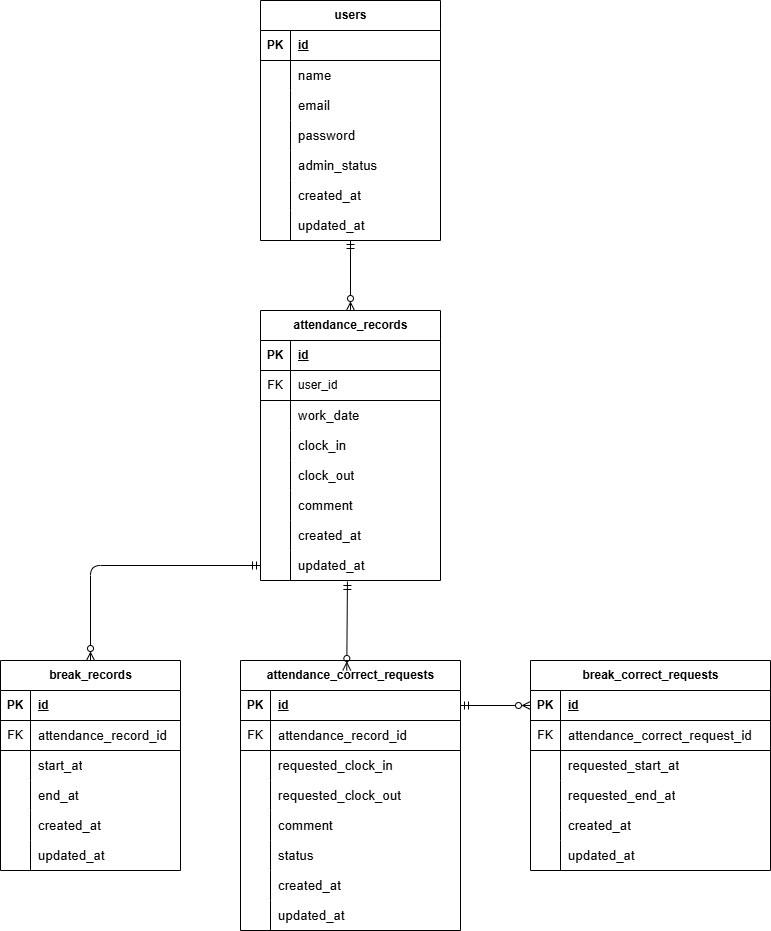

# アプリ名

## 概要


## 環境構築


## 使用技術 (実行環境)

- PHP 8.1
- Laravel 8.75
- MySQL 8.0.26
- Nginx 1.21.1

## URL

- 開発環境：http://localhost/
- phpMyAdmin：http://localhost:8080/

## テスト用アカウント


## テスト実行方法

```bash
php artisan test
```

## ER図



